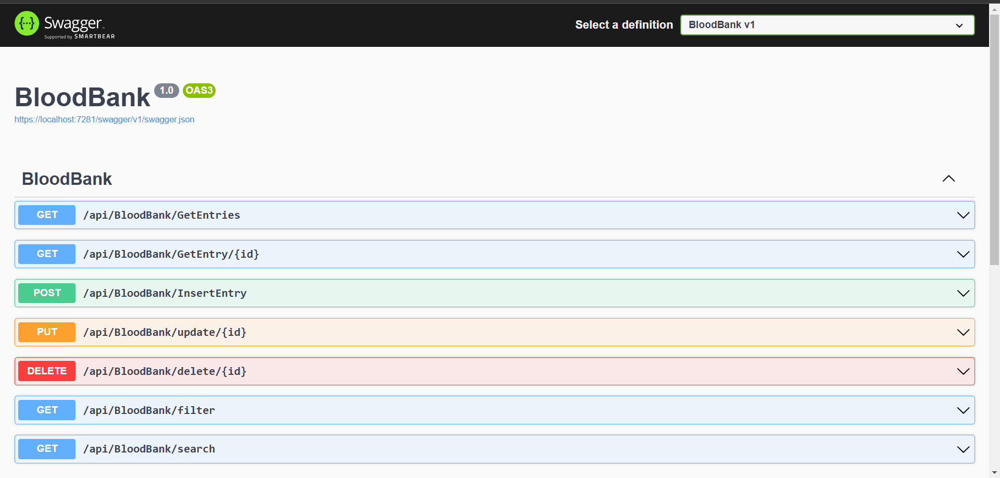

# Blood Bank Management API

## Overview
The **Blood Bank Management API** is a RESTful service designed to manage blood bank records efficiently. It provides CRUD operations, pagination, and search functionalities to help streamline the management of blood donations and inventory.

---

## Features

### CRUD Operations
- **Create (POST /api/BloodBank/InsertEntry)**: Add a new blood bank entry. Requires donor details, blood type, quantity, collection date, and expiration date.
- **Read All (GET /api/BloodBank/GetEntries)**: Retrieve all blood bank entries.
- **Read by ID (GET /api/BloodBank/GetEntry/{id})**: Retrieve a specific blood entry using its ID.
- **Update (PUT /api/BloodBank/update/{id})**: Update an existing blood bank entry, such as modifying donor details or updating the status.
- **Delete (DELETE /api/BloodBank/delete/{id})**: Remove a blood bank entry using its ID.

### Pagination
- **GET /api/bloodbank/filter?page={pageNumber}&size={pageSize}**: Retrieve a paginated list of blood entries.

### Search Functionality
- **Search by Blood Type**: `GET /api/bloodbank/search?bloodType={bloodType}`.
- **Search by Status**: `GET /api/bloodbank/search?status={status}`.
- **Search by Donor Name**: `GET /api/bloodbank/search?donorName={donorName}`.

---

## Data Model
The `BloodBankEntry` model includes the following attributes:
- **Id**: A unique identifier for the entry (auto-generated).
- **DonorName**: Name of the donor.
- **Age**: Donor's age.
- **BloodType**: Blood group of the donor (e.g., A+, O-, B+).
- **ContactInfo**: Donor's contact details (phone number or email).
- **Quantity**: Quantity of blood donated (in ml).
- **CollectionDate**: Date when the blood was collected.
- **ExpirationDate**: Expiration date for the blood unit.
- **Status**: Status of the blood entry (e.g., "Available", "Requested", "Expired").

